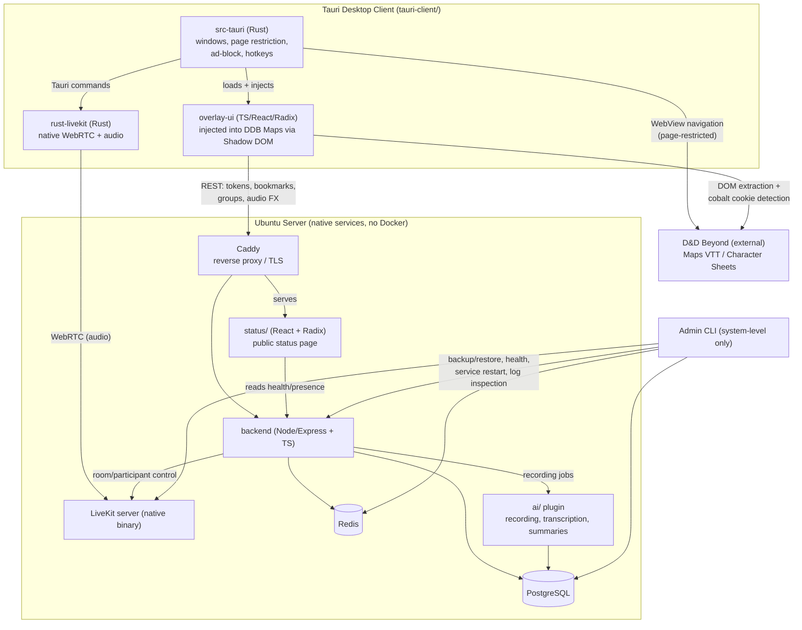

# Architecture Overview

This document expands [CLAUDE.md §2 (Mono-Repo Structure)](../../CLAUDE.md) and [§7 (Core Technologies)](../../CLAUDE.md) into a system diagram and per-module responsibility summary. It is the entry point for understanding how the pieces fit together; it does not replace CLAUDE.md as the source of truth for constraints.

## System Diagram

## Module Responsibilities

- **`tauri-client/src-tauri/`** — the Tauri shell: window management, page-restriction allowlist, ad-block request interception, global hotkeys, and the Tauri command bridge to `rust-livekit`. Owns cobalt cookie detection at the WebView level.
- **`tauri-client/rust-livekit/`** — native LiveKit client: WebRTC, audio device control, echo cancellation, track/group management. Runs once per app instance so audio survives window switches.
- **`tauri-client/overlay-ui/`** — the injected Shadow DOM overlay (voice controls, chat, group selector, DM controls). React + Radix UI. Talks to the backend over REST and to the Rust shell over Tauri IPC.
- **`ddb/`** — DDB auth and extraction: cobalt cookie → JWT exchange, Character Service calls, DOM extraction helpers and the TypeScript types for what comes back. Consumed by `overlay-ui`, which does the full extraction client-side and hands the normalized result to `backend` — see [DDB-AUTH.md](DDB-AUTH.md). `backend` does not depend on `ddb/` directly.
- **`backend/`** — Node/Express API: LiveKit token issuance, campaign/room mapping, bookmarks, group + audio FX endpoints, serves the status page and client downloads, hosts the AI job queue endpoints.
- **`ai/`** — recording, transcription (Whisper.cpp / cloud), and AI summary generation, anchored to DM bookmarks. Optional at runtime; off by default.
- **`status/`** — the public, read-only status page (React + Radix): service health, connected players, current campaign/room/map, client download links.
- **`shared/`** — cross-module TypeScript types and contracts (DDB character/campaign shapes, bookmark types, Tauri IPC event payloads) so `ddb/`, `backend/`, `overlay-ui/`, and `status/` don't redefine the same shapes.
- **`livekit/`** — LiveKit server configuration and helper scripts for the native binary.
- **`infra/`** — Ubuntu deployment: install script, systemd units, config generation.

## Network Topology (STUN/TURN & Ports)

`rust-livekit` talks to the LiveKit server directly — players never connect to each other peer-to-peer. Because the SFU is always the public-facing side of every connection, **STUN alone is sufficient for the common case**: a player behind NAT (including CGNAT) only needs to discover their own reflexive address and send outbound UDP to the SFU, which NAT/CGNAT does not block. This is a materially simpler trust model than a mesh/P2P voice system would need.

- **Default:** STUN for ICE candidate discovery (LiveKit's default STUN servers, optionally with `stun.cloudflare.com:3478` added to the ICE server list for redundancy — free, no account needed), plus LiveKit's own `7881/tcp` ICE fallback for clients that can't establish UDP at all (VPNs, some corporate networks).
- **Optional fallback:** LiveKit's _built-in_ TURN/TLS server, enabled in `livekit/`'s config and exposed on `443`, for the remaining edge cases STUN + the TCP fallback don't cover — symmetric NAT, hotel wifi, and firewalls that permit only port 443 outbound. This is a native LiveKit feature, not a separate service or third-party dependency, so it stays consistent with [CLAUDE.md §4](../../CLAUDE.md)'s native-services/no-Docker requirement. It's off by default and only matters for players on unusually restrictive networks.
- **Cloudflare Tunnel** (if an operator chooses to front their Caddy instance with one) may only carry the HTTPS signaling/API/status-page paths. It cannot carry LiveKit's UDP media or the TCP ICE fallback — `cloudflared` doesn't proxy arbitrary WebRTC traffic — so those ports always need direct port-forwarding to the server regardless of what fronts the HTTP(S) paths.

Concrete port requirements and TURN config live in [livekit/README.md](../../livekit/README.md); the operator-facing firewall/port-forwarding checklist lives in [infra/README.md](../../infra/README.md).

## Data Flow Notes

- **Audio never routes through the backend.** `rust-livekit` talks to the LiveKit server directly over WebRTC; the backend only issues tokens and manages room/participant metadata.
- **The overlay is the only custom UI inside DDB.** Everything else the user sees (Maps, Character Sheets, Rules) is DDB's own page, loaded in a page-restricted WebView — see [CLAUDE.md §8.1](../../CLAUDE.md).
- **The Admin CLI never touches gameplay data** (rooms, bookmarks, campaign mapping) — only system-level operations. See [CLAUDE.md §6](../../CLAUDE.md).
